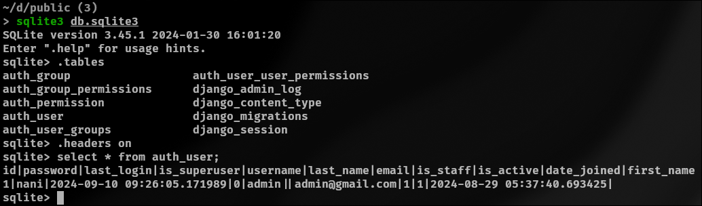
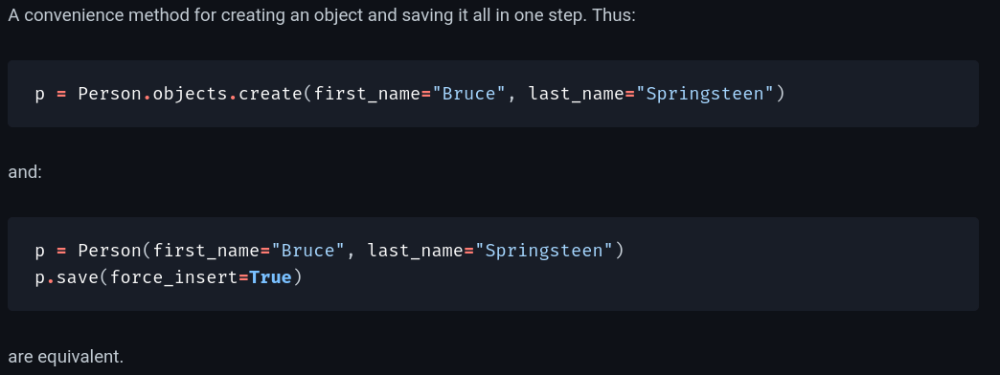
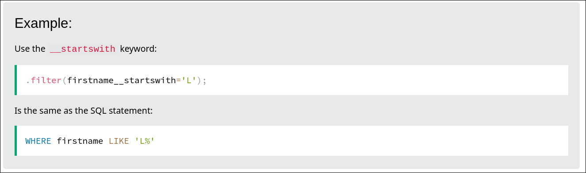
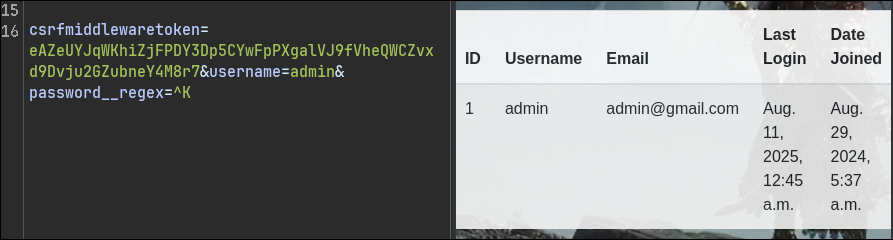

### Giới thiệu challenge và cái nhìn ban đầu

Đọc source code cho ta thấy được đây là một ứng dụng Django dạng web cơ bản có tác dụng register/login và unpickle dữ liệu người dùng. Tại `Dockerfile` ta thấy được service sử dụng sqlite3, docker tạo một file flag-random.txt và cấu hình mật khẩu ngẫu nhiên 128 kí tự cho admin.

Challenge cũng cung cấp cho ta `db.sqlite3`, ta sẽ kiểm tra database xem cấu trúc nó ra sao



Vậy là ở đây ta có bảng auth_user với các trường is_superuser, is_staff. Đặc biệt là có vẻ như password không được lưu dưới dạng hash mà là plaintext. Đến đây mình đã thử login với mật khẩu `nani` nhưng tất nhiên là không đúng do docker đã thực hiện đặt lại mật khẩu trong quá trình build.

Tiếp theo ta quan tâm tới logic của trang web nằm trong `app/views.py` và `app/sandbox.py`

### Khai thác các lỗi trong views.py

Tại đây ta được cung cấp 5 entry points bao gồm HomePage, SignupPage, LoginPage, LogoutPage và AdminPage.  Đầu tiên ta phân tích cách một user có thể đăng ký tài khoản ra sao: người dùng nhập thông tin vào 4 field username, email, password và confirm_pasword. Nếu thông tin hợp lệ thì thực hiện đăng ký người dùng mới như sau:

```python
user = User.objects.create(**user_data)
user.save()
```

Trong django, `User.objects` là một instance của class UserManager, nó cung cấp các phương thức truy vấn và thao tác nhanh lên database.

https://docs.djangoproject.com/en/5.2/ref/models/querysets/#django.db.models.query.QuerySet.create



Nói một cách dễ hiểu, `create()` cung cấp dev một cách nhanh gọn để thực hiện insert giá trị. Tuy nhiên đây không phải là cách chính xác để tạo một user mới do không hỗ trợ hash chuỗi mật khẩu.

[Difference between User.objects.create_user() vs User.objects.create() vs User().save() in django - Stack Overflow](https://stackoverflow.com/questions/63054997/difference-between-user-objects-create-user-vs-user-objects-create-vs-user)

 Tại bài viết Stack Overflow này đã cho ta thấy một ví dụ sử dụng `create_user()`, mật khẩu ở đây đã được tự động hash sử dụng PBKDF2 và SHA-256, tuy nhiên `create()` lưu trữ dữ liệu ở dạng plain text. Điều này hợp lý với việc ta thấy password không được hash khi kiểm tra db.sqlite3 ở trên. Để rõ hơn về vấn đề này, mình đã thử debug xem create hoạt động ra sao [tại đây](#_chain_create), ta dễ thấy django đơn giản chỉ thực hiện câu lệnh INSERT.

Như vậy là ta đã lý giải được tại sao mật khẩu lại là plaintext và cách user đăng ký, tiếp tục phân tích các hoạt động khác của user: ta nhận thấy rằng khi user thực hiện login hoặc thực hiện hành động search trong homepage đều sử dụng:

```python
user = User.objects.filter(**user_data).first()
```

 [Advice to get single object using get() or filter().first()](https://www.reddit.com/r/django/comments/6plqbn/advice_to_get_single_object_using_get_or/)

Tại bài viết này, tác giả đã đề cập tới việc so sánh hai phương thức `.get()` và `.filter().first()`. Nói một cách nhanh gọn, .get() chỉ lấy duy nhất 1 đối tượng thỏa mãn điều kiện đầu vào trong khi kết hợp .filter().first() sẽ lấy ra đối tượng đầu tiên trong các đối tượng được query (tương tự LIMIT 1). Trong trường hợp của chúng ta, service đang sử dụng cách thứ hai đồng thời nhận trực tiếp userinput qua **kwags cho nên tồn tại lỗ hổng ORM leak qua các field lookup.

[Django QuerySet - Filter](https://www.w3schools.com/django/django_queryset_filter.php)

Tại bài viết này của w3school đã giới thiệu về Field lookup, nó hỗ trợ việc tạo ra các WHERE clause một cách cụ thể, một ví dụ:



Quay lại phần code của enpoint HomePage, ở đây sử dụng:

```python
user_data = parse_qs(request.body.decode('utf-8'))
user_data.pop('csrfmiddlewaretoken', None)
user_data = {k: v[0] for k, v in user_data.items()}
try:
    users = []
    user = User.objects.filter(**user_data).first()
```

Tại đây, ta có thể thêm tùy chỉnh các keywork argument (**kwags) vào trong filter() do `user_data` parse toàn bộ data trong request. Điều đó đồng nghĩa với việc ta có thể thêm các field lookup một cách tùy chỉnh để khai thác.

Ví dụ đơn giản như sau: nếu post data chứa `username=admin` thì backed sẽ thực hiện `User.objects.filter(username="admin").first()` thực hiện trả về kết quả đầu tiên của query. Nhưng nếu ta truyền `username=admin&password__regex=^K` thì `filter(username="admin", password__regex="K").first()` sẽ được thực thi và đồng thời áp dụng thêm điều kiện regex, nếu kết quả vẫn trả về thì đồng nghĩa với việc password của admin thỏa mãn regex ^K.

https://github.com/swisskyrepo/PayloadsAllTheThings/blob/master/ORM%20Leak/README.md

Ở tài liệu trên đã cung cấp một số cách để khai thác bao gồm việc sử dụng __startswith, __contains và __regex cho trường hợp của chúng ta. Logic để khai thác tương tự nhau: brute-force từng kí tự rồi quan sát kết quả trả về từ đó trích xuất dữ liệu. Ví dụ như ta có thể thử `password__startswith = 'abc'`, nếu kết quả trả về là tài khoản admin thì ta biết mật khẩu bắt đầu với 'abc', lặp lại quá trình để trích xuất hết mật khẩu. 

Ta đang làm việc với Sqlite3 nơi LIKE clause không hỗ  trợ case-sensitive. Vậy nên ta sẽ sử dụng field lookup `__regex` để trích xuất data.



Vậy để trích xuất toàn bộ data ta có thể sử dụng script python sau: [script](#_task9_bf)

Sau khi chạy script, ta nhận được mật khẩu của admin và thành công login. `Kpvwmec6swPh6WFFo6BFnf0HKgmr5otfEZj9sSxKNNs9PhsRhCEAOGqVL6VyAiI32EppTmsIeT8kY7aelEvtGkQXsF2t0UKcZmOGvDbPkm6acsKUALXb6zJWmqpRbm8A`

### Khai thác lỗi trong sandbox.py

Khi đăng nhập với tài khoản admin ta có thể truy cập page AdminPage và thực hiện hàm unpickle trong `sandbox.py`

Chi tiết phần tìm hiểu và cách khai thác được trình bày chi tiết trong 

[Về OPCODE trong bypass pickle](#V%E1%BB%81%20OPCODE%20trong%20bypass%20pickle)

Phần trình bày trên bao gồm các phần tìm hiểu về kiến thức cơ bản của pickle, OPCODE được sử dụng trong pickle và cách khai thác nâng cao sử dụng bytecodes được build thủ công, đồng thời áp dụng trực tiếp vào challenge đi kèm giải thích cụ thể. Các tài liệu tham khảo gồm tài liệu chính thức của python và các bài viết public.

Sau khi lấy được một reverse shell, thực hiện cat flag như sau:


### Thất bại trong việc lên root

Sau khi nhận được fake flag, ta kiểm tra xem Docker file có cấu hình đặc biệt gì hay không nhưng cũng không có gì đặc biệt. Có thể author đã setup bằng tay trong docker nên mình thực hiện recon và có một số kết quả như sau:

- `find / -type f -name "*.sh" 2>/dev/null` thực hiện kiểm tra toàn bộ file thực thi trong hệ thống nhưng không có file nào đặc biệt.

- không có cronjobs, không có SUID có thể khai thác, không thể dùng sudo

- research google: `5.15.0-119-generic privilege escalation exploit site:exploit-db.com` trả về DirtyPipe (CVE-2022-0847) nhưng thử nghiêm trên server thất bại do môi trường Docker
