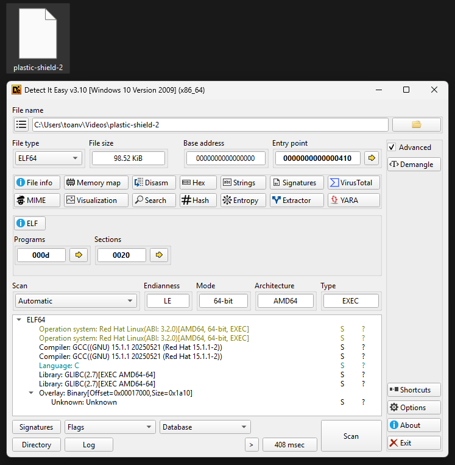

# Công cụ 

## 1. Detect It Easy

```Detect-It-Easy (DiE)``` là một công cụ mã nguồn mở dùng để xác định loại file, đặc biệt hữu ích cho các nhà phân tích malware, chuyên gia bảo mật và reverse engineering. Nó hỗ trợ phân tích dựa trên chữ ký (signature) và heuristic, giúp xác định các định dạng file như PE, ELF, APK, và nhiều loại khác. DiE hoạt động trên Windows, Linux và macOS, với giao diện đồ họa (GUI), dòng lệnh (CLI) và phiên bản nhẹ.

Công cụ được phát triển bởi ```horsicq``` và có thể tải từ GitHub: https://github.com/horsicq/Detect-It-Easy.
DiE hỗ trợ:

- Xác định loại file, packer, bảo vệ.
- Phân tích entropy để phát hiện nén hoặc mã hóa.
- Tùy chỉnh chữ ký và script (sử dụng ngôn ngữ giống JavaScript).
- Giảm false positive nhờ kết hợp signature và heuristic.

### 1.1 Cài đặt

Tải Binary Đã Build Sẵn: ```https://github.com/horsicq/DIE-engine/releases.``` (tải phù hợp với hệ điều hành)

### 1.2 Sử dụng (cách đơn giản nhất dùng GUI)

Kéo thả trực tiếp file vào tool để phân tích.

Ví dụ: 



Từ ảnh chúng ta có thể xác định những thông tin như:
- File: plastic-shield-2 → ELF64 (Linux executable, 64-bit)
- Ngôn ngữ: C
- Compiler: GCC 15.1.1 (Red Hat)
- Library: GLIBC 2.7
- Endianness: Little Endian (LE)

## 2. HxD

HxD là một trình chỉnh sửa hex (hex editor) và trình chỉnh sửa đĩa (disk editor) miễn phí, được phát triển bởi Maël Hörz.

### 2.1 Tính năng chính

- Mở file/ổ đĩa/RAM để phân tích dữ liệu.

- Chỉnh sửa hex/text.

- Undo/Redo đầy đủ.

- Tìm kiếm & thay thế (theo hex, text).

- Xác định file, cấu trúc file

### 2.2 Các phím tắt hữu ích

```Ctrl+O``` → Mở file.

```Ctrl+Shift+D``` → Mở disk.

```Ctrl+Shift+R``` → Mở RAM.

```Ctrl+G``` → Đến offset.

```Ctrl+F / Ctrl+R``` → Tìm kiếm / Thay thế.

```Ctrl+Z / Ctrl+Y``` → Undo / Redo.

### 2.3 Video hướng dẫn cài đặt, sử dụng cơ bản

[Link 1](https://www.youtube.com/watch?v=3xFQM6d7vnA&pp=ygUPSHhEIFdhbGt0aHJvdWdo)

[Link 2](https://www.youtube.com/watch?v=UlxKi9DJX6o)


## 3. IDA (Interactive Disassembler)

IDA là một trong những công cụ disassembler và debugger mạnh mẽ nhất cho reverse engineering, được phát triển bởi Hex-Rays. IDA hỗ trợ phân tích mã máy từ nhiều kiến trúc processor khác nhau và chuyển đổi chúng thành assembly code dễ đọc.

### 3.1 Tính năng chính

- **Multi-processor support**: Hỗ trợ hơn 50 kiến trúc processor (x86, x64, ARM, MIPS, PowerPC, etc.)
- **Interactive analysis**: Cho phép phân tích tương tác, tự động nhận diện functions, loops, variables
- **Graph view**: Hiển thị control flow graph của functions
- **Hex view**: Xem dữ liệu raw dưới dạng hex
- **Cross-references**: Theo dõi references giữa các functions/variables
- **Plugin support**: Hỗ trợ Python scripting và plugins
- **Decompiler**: IDA Pro có Hex-Rays decompiler chuyển assembly về C-like code

### 3.2 Các phiên bản

- **IDA Free**: Miễn phí, giới hạn cho file 64-bit và một số tính năng
- **IDA Pro**: Phiên bản trả phí đầy đủ tính năng
- **IDA Home**: Phiên bản giá rẻ cho mục đích học tập/cá nhân

### 3.3 Interface chính

- **Disassembly View**: Hiển thị assembly code
- **Graph View**: Hiển thị control flow graph
- **Hex View**: Hiển thị dữ liệu hex raw
- **Functions Window**: Danh sách các functions được nhận diện
- **Names Window**: Danh sách các symbols/labels
- **Strings Window**: Danh sách các strings trong binary

### 3.4 Phím tắt hữu ích

```G``` → Đến địa chỉ cụ thể

```Space``` → Chuyển đổi giữa Graph view và Text view

```X``` → Xem cross-references

```N``` → Rename function/variable

```C``` → Convert to code

```D``` → Convert to data

```A``` → Convert to ASCII string

```F5``` → Decompile (nếu có Hex-Rays)

```Ctrl+X``` → Exit

```Ctrl+S``` → Save database

### 3.5 Workflow cơ bản

1. **Mở file**: File → Open → Chọn file cần phân tích
2. **Phân tích tự động**: IDA sẽ tự động phân tích và nhận diện functions
3. **Tìm entry point**: Thường là main() hoặc start address
4. **Phân tích functions**: Sử dụng Graph view để hiểu logic
5. **Rename variables/functions**: Đặt tên có ý nghĩa để dễ theo dõi
6. **Add comments**: Thêm comment để ghi chú logic

### 3.6 Tips cho người mới bắt đầu

- Bắt đầu với IDA Free để làm quen
- Sử dụng Graph view để hiểu control flow
- Đặt tên có ý nghĩa cho functions/variables
- Sử dụng cross-references để theo dõi data flow
- Kết hợp với debugger khác (x64dbg, GDB) để dynamic analysis

### 3.7 Tài liệu tham khảo

[IDA Official Documentation](https://hex-rays.com/documentation/)

[IDA Python API](https://hex-rays.com/products/ida/support/idapython_docs/)

